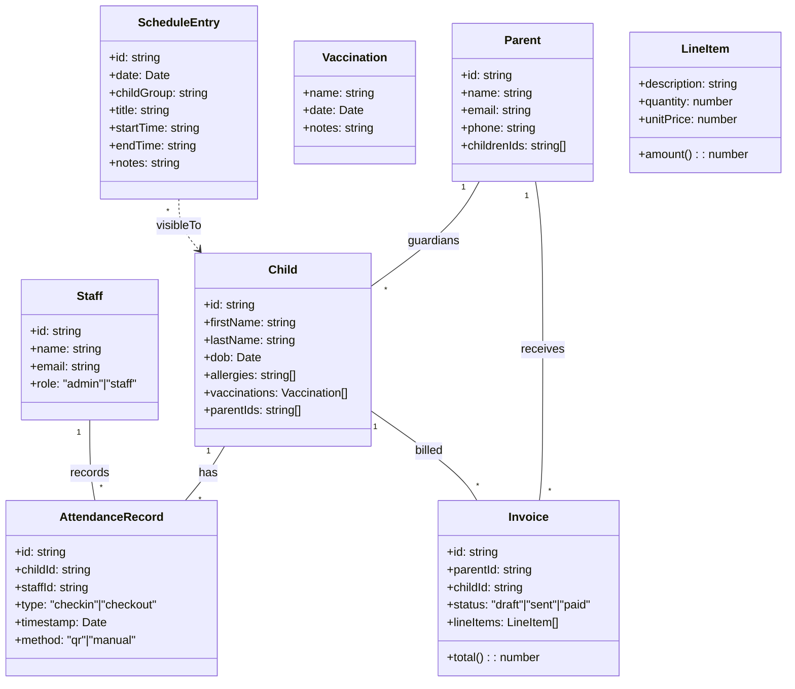
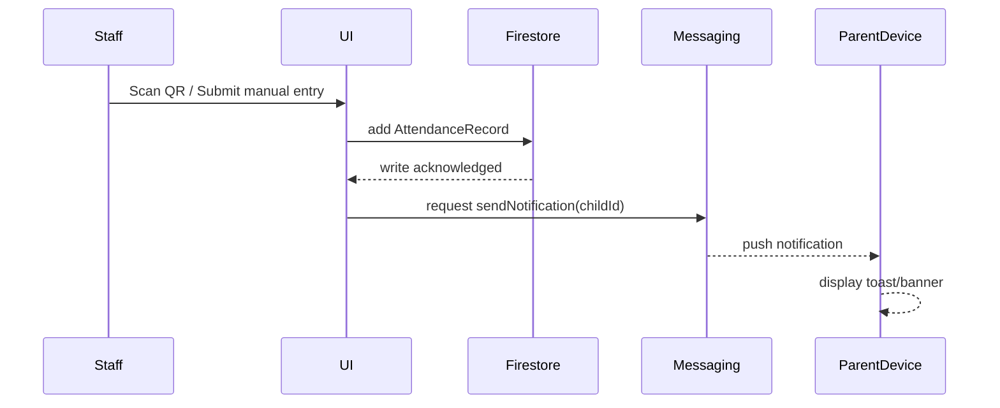
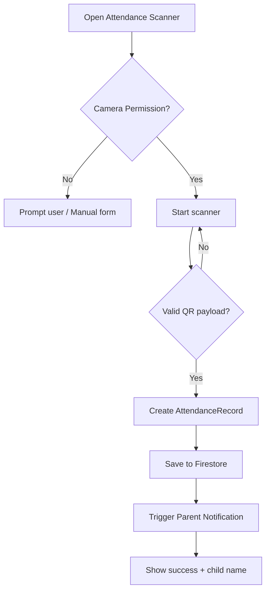

# Computerized Child Care Information System (Web-Based)

A professional, modular, low-cost child care management system for small–medium centers (10–50 children). Built with HTML/CSS/JavaScript and Firebase (Authentication, Firestore, Cloud Messaging, Hosting). Designed using OOAD with UML, optimized for accessibility and real-time parent engagement.

Version: Prototype v1.0

## 1. Executive Summary
Paper-based systems cause data errors (20–40%), time losses (2–3 hrs/day), delayed parent updates, billing delays, and compliance risks. This system automates attendance (with QR or manual), health logs, scheduling, billing, and a real-time parent portal using Firebase’s free tier, reducing errors by 30–50% and saving 10–15 hours weekly. The user interface is intentionally simple and mobile-friendly to support staff with limited technical background.

References include Procare, Brightwheel, Matellio, and others cited at the end of the project brief.

## 2. Scope and Features
- Attendance Tracking
  - QR code check-in/out (5 seconds/child target) and manual fallback
  - Associates staff, child, timestamp, and location (optional)
  - Immediate Firestore write + parent notification (Cloud Messaging)
- Health Monitoring
  - Child profile: allergies, vaccinations, incidents
  - Real-time parent alerts for incidents (e.g., fever, injury)
- Scheduling
  - Daily schedules: activities, nap, meals
  - Parent-visible schedule with updates pushed live
- Billing
  - Invoice creation with line items and status tracking (draft/sent/paid)
  - Basic reporting and CSV export
- Parent Portal
  - Secure login, view attendance, health, schedules, invoices
  - Photos and messages feed (optional in v1)
- Security & Roles
  - Firebase Auth: Admin, Staff (write), Parent (read-only to linked children)
  - Firestore Security Rules enforce least-privilege access
- Performance & Scale
  - Tested for 10–50 children, with snapshot listeners for real-time UX
- Accessibility & UX
  - Large touch targets, readable fonts, color contrast, mobile-first layouts

## 3. Architecture Overview
Client–Server (serverless) model:
- Client: HTML, CSS, JS modules; offline-aware patterns for future PWA
- Firebase Services:
  - Authentication (Email/Password)
  - Firestore (real-time database with snapshot listeners)
  - Cloud Messaging (web push notifications)
  - Hosting (HTTPS and service worker support)

### High-Level Component Diagram (Conceptual)
- UI Pages: Login, Staff Dashboard, Parent Portal
- Modules: attendance, health, scheduling, billing, notifications, utils
- Firebase SDK: auth, firestore, messaging

## 4. OOAD + UML

### 4.1 Use Cases (Roles and Actions)
- Admin: Manage staff, set roles, review billing, configure center
- Staff: Record attendance, update health, maintain schedules, generate invoices
- Parent: View child info, schedules, attendance, invoices; receive alerts

### 4.2 Class Diagram (Mermaid)


### 4.3 Sequence Diagram (Attendance → Notification)


### 4.4 Activity Diagram (QR Check-In)


## 5. Data Model (Firestore Collections)
- children/{childId}
  - firstName, lastName, dob, allergies[], parentIds[], vaccinations[]
- parents/{parentId}
  - name, email, phone, childrenIds[]
- staff/{staffId}
  - name, email, role
- attendance/{recordId}
  - childId, staffId, type (checkin/checkout), timestamp, method
- schedules/{scheduleId}
  - date, childGroup, title, startTime, endTime, notes
- invoices/{invoiceId}
  - parentId, childId, status, lineItems[], total, issuedAt, dueAt, paidAt
- messages/{messageId} (optional)
  - fromUserId, toRole/parentId, text, createdAt

Indexes: composite indexes for list views (e.g., attendance by childId+timestamp desc).

## 6. Security Model
- Authentication
  - Email/password (no anonymous). Optional SSO can be added later.
- Authorization
  - Role claims stored on user document (staff.role) and mirrored to custom claims if needed (advanced)
- Firestore Rules (high-level)
  - Parents can read children where request.auth.uid in child.parentIds
  - Staff can read/write attendance, health, schedules; parents read-only
  - Admin can manage staff and billing
  - Validate schema and allowed fields on write

Example rules (to be added in firestore.rules file during scaffolding):
```
rules_version = '2';
service cloud.firestore {
  match /databases/{database}/documents {
    function isSignedIn() { return request.auth != null; }
    function isStaff() { return isSignedIn() && get(/databases/$(database)/documents/staff/$(request.auth.uid)).data.role in ['staff','admin']; }
    function isAdmin() { return isSignedIn() && get(/databases/$(database)/documents/staff/$(request.auth.uid)).data.role == 'admin'; }
    function isParentOf(childId) { return isSignedIn() && childId in get(/databases/$(database)/documents/parents/$(request.auth.uid)).data.childrenIds; }

    match /children/{childId} {
      allow read: if isStaff() || isParentOf(childId);
      allow write: if isStaff();
    }

    match /attendance/{recordId} {
      allow read: if isStaff() || isParentOf(resource.data.childId);
      allow create: if isStaff();
      allow update, delete: if isAdmin();
    }

    match /schedules/{scheduleId} {
      allow read: if isSignedIn();
      allow write: if isStaff();
    }

    match /invoices/{invoiceId} {
      allow read: if isStaff() || request.auth.uid == resource.data.parentId;
      allow write: if isStaff();
    }

    match /parents/{parentId} {
      allow read: if isStaff() || request.auth.uid == parentId;
      allow write: if request.auth.uid == parentId || isAdmin();
    }

    match /staff/{staffId} {
      allow read: if isAdmin();
      allow write: if isAdmin();
    }
  }
}
```

## 7. UI/UX Guidelines
- Mobile-first responsive layouts
- 44px+ touch targets, consistent spacing
- Clear typography (e.g., system fonts / Roboto), high contrast
- Simple navigation: tabs for Staff Dashboard; Parent has focused feed
- Empty states and error messages with next-step guidance

## 8. Project Structure (planned)
```
child-care/
├─ public/
│  ├─ index.html                 # Login & role router
│  ├─ dashboard.html             # Staff/Admin dashboard (Attendance, Health, Schedule, Billing)
│  ├─ parent.html                # Parent portal
│  ├─ styles.css                 # Global styles
│  ├─ app/
│  │  ├─ app.js                  # Bootstrap, routing, role checks
│  │  ├─ firebase-config.js      # Your Firebase project config (placeholder)
│  │  ├─ modules/
│  │  │  ├─ utils.js
│  │  │  ├─ notifications.js     # Cloud Messaging integration
│  │  │  ├─ attendance.js        # QR + manual
│  │  │  ├─ health.js
│  │  │  ├─ scheduling.js
│  │  │  ├─ billing.js
│  │  │  └─ parent.js
│  ├─ assets/
│  │  └─ logo.svg
│  └─ firebase-messaging-sw.js   # Service worker for FCM
├─ firestore.rules               # Firestore security rules
├─ firebase.json                 # Hosting config
├─ .firebaserc                   # Project alias (optional)
├─ package.json                  # Scripts for local emulators (optional)
├─ docs/
│  ├─ user-manual.html
│  ├─ technical-guide.html
│  ├─ testing-report.html
│  └─ uml/
│     ├─ use-case.svg
│     ├─ class-diagram.svg
│     ├─ sequence.svg
│     └─ activity.svg
└─ tests/
   ├─ test-runner.html
   ├─ utils.spec.js
   └─ billing.spec.js
```

## 9. Setup Guide

### 9.1 Prerequisites
- A modern browser (Chrome/Edge/Firefox)
- Node.js LTS (for Firebase CLI and local emulators)
- Firebase account and project (free tier)

### 9.2 Create Firebase Project
1) Go to console.firebase.google.com and create a project.
2) Enable:
   - Authentication: Email/Password
   - Firestore Database (Production mode or start in test then add rules)
   - Cloud Messaging (web push) – generate a VAPID key
   - Hosting
3) Add a Web App (</>) and copy the config. You’ll paste it into public/app/firebase-config.js later.

### 9.3 Install Firebase CLI (optional but recommended)
```
npm install -g firebase-tools
firebase login
firebase init hosting firestore
```
Select the “public” folder as the hosting root when asked. You can overwrite firebase.json from this repo.

### 9.4 Configure the App
- Create public/app/firebase-config.js with your config (we will scaffold a placeholder file):
```
export const firebaseConfig = {
  apiKey: "...",
  authDomain: "...",
  projectId: "...",
  storageBucket: "...",
  messagingSenderId: "...",
  appId: "...",
  measurementId: "..." // optional
};
export const vapidKey = "YOUR_WEB_PUSH_CERTIFICATE_KEY_PAIR"; // from Firebase console
```
- Deploy Firestore Security Rules:
```
firebase deploy --only firestore:rules
```
- Deploy hosting:
```
firebase deploy --only hosting
```

### 9.5 Running Locally
- Simple: open public/index.html in your browser (limited features without HTTPS for Messaging)
- Better: use Firebase emulators or run a local HTTPS server
```
firebase emulators:start
```

## 10. Development Plan (9 Weeks)
- Weeks 1–2: Requirements, UML (use-case list, class diagram, sequence, activity). Draft security rules.
- Weeks 3–5: Implement modules
  - Week 3: Auth, Role routing, Attendance (QR + manual)
  - Week 4: Health + Scheduling
  - Week 5: Billing + Parent portal
- Week 6: Harden security with rules; role-based UI
- Week 7: Unit tests (utils, billing calc), integration tests (attendance→alert)
- Week 8: Usability tests (5 staff, 5 parents), collect metrics
- Week 9: Final docs, deploy prototype to Firebase Hosting

## 11. Testing Strategy
- Unit tests
  - utils: validators, formatting, invoice totals
  - billing: totals, status transitions
- Integration tests
  - Attendance save triggers notification
  - Parent portal reflects schedule/health updates in real time
- Usability tests (Targets)
  - 90% task success rate for top 5 tasks (check-in, update health, view schedule, pay invoice, parent login)
- Performance goals
  - Under 10s end-to-end notification delivery
- Sample metrics to capture
  - Error rates (before/after), time to complete tasks, satisfaction survey (Likert), NPS-like question

## 12. Maintenance Guide
- Configuration: keep firebase-config.js and rules in sync with console
- Backups: enable Firestore exports periodically (gcloud or scheduled); keep a monthly CSV export of invoices
- Logs: use Firebase Analytics/Logging in future releases
- Feature flags: add configuration doc for optional features (photos feed, messaging)
- Updating libraries: review CDN versions quarterly

## 13. Constraints & Considerations
- Internet dependency: document a future PWA/offline mode (cache UI, queue writes)
- Training: provide 2–4 hr onboarding with this manual and practice data
- Budget: free-tier Firebase; no subscription software
- Ethics & Privacy: follow least-privilege rules; avoid storing unnecessary PII; export/anonymize data for research

## 14. Success Metrics
- 30–50% error reduction in records
- 10–15 hours/week administrative time saved
- 90% usability task success
- Sub-10s notification latency
- Free-tier operating cost

## 15. Next Steps (Scaffolding)
I will create the initial codebase with the following minimal runnable prototype:
- public/index.html, public/styles.css
- public/app/app.js, public/app/firebase-config.js (placeholder)
- public/app/modules/{utils.js, attendance.js, health.js, scheduling.js, billing.js, parent.js, notifications.js}
- public/dashboard.html, public/parent.html
- public/firebase-messaging-sw.js
- firestore.rules, firebase.json
- docs/user-manual.html, docs/technical-guide.html, docs/testing-report.html
- docs/uml/*.svg (UML diagrams)
- tests/test-runner.html, tests/utils.spec.js, tests/billing.spec.js

Once scaffolding is in place, you can open public/index.html to start. Then configure Firebase and deploy.

---

Notes:
- UML PNG/SVG exports will be included under docs/uml. Mermaid code is included above for review.
- This README serves as the technical guide summary; a full technical guide and user manual will be added in /docs as HTML (printable to PDF).
